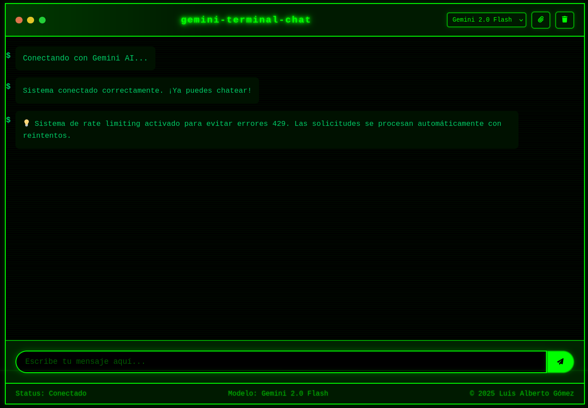

# 🤖 Gemini Terminal v1.0

Una página web moderna de chat con inteligencia artificial que utiliza la API de Google Gemini. Diseñada con una interfaz de terminal estilo hacker para una experiencia única y profesional.

## ✨ Características Principales

- **🎯 Chat en tiempo real** con múltiples modelos de Gemini AI
- **🎨 Interfaz de terminal** con efectos visuales estilo hacker
- **📺 Línea de escaneo CRT** que simula pantallas antiguas
- **📁 Carga de archivos** con análisis automático por IA
- **⚡ Sistema de rate limiting** con reintentos automáticos
- **📋 Botón de copiar** solo en respuestas de IA
- **📱 Diseño responsive** para todos los dispositivos
- **📝 Código completamente documentado**
- **🔧 Configuración de API Key externa**

## 🚀 Uso

### Ejecutar la Página Web

```bash
# Desde el directorio del proyecto
python3 -m http.server 8000
```

Luego abre tu navegador en: `http://localhost:8000`

## 📸 Capturas de Pantalla



*Interfaz principal de Gemini Terminal mostrando el tema hacker con colores verdes, línea de escaneo CRT y diseño de terminal.*

## ⚙️ Configuración

1. **Obtener API Key de Google Gemini:**
   - Ve a [Google AI Studio](https://makersuite.google.com/app/apikey)
   - Crea una nueva API Key

2. **Configurar la aplicación:**
   - Edita el archivo `script.js`
   - Busca la línea con `apiKey: 'TU_API_KEY_AQUI'`
   - Reemplaza `'TU_API_KEY_AQUI'` con tu clave API real

## 🎮 Uso de la Página Web

### Funcionalidades

- **💬 Chat**: Escribe mensajes y recibe respuestas de Gemini AI
- **📁 Cargar archivos**: Arrastra archivos para análisis automático
- **🔄 Cambiar modelo**: Selecciona entre diferentes modelos de Gemini
- **📋 Copiar respuestas**: Botón de copiar en respuestas de IA
- **🧹 Limpiar chat**: Botón para limpiar la conversación

## 🗑️ Eliminación

Para eliminar la página web, simplemente borra la carpeta del proyecto.

## 📁 Estructura del Proyecto

```
gemini-terminal/
├── index.html          # Interfaz principal
├── script.js           # Lógica JavaScript
├── style.css           # Estilos con tema hacker
├── icon.png            # Icono de la aplicación
├── appweb.png          # Captura de pantalla de la interfaz
├── LICENSE             # Licencia MIT y créditos completos
└── README.md           # Este archivo
```

## 🎨 Tema Hacker

La aplicación incluye:
- **Colores verdes** estilo terminal
- **Fuente monospace** para autenticidad
- **Línea de escaneo CRT** animada
- **Efectos visuales** retro
- **Interfaz minimalista** y funcional

## 🔧 Requisitos del Sistema

- **Python**: 3.x (para servidor local)
- **Navegador**: Cualquier navegador moderno
- **Memoria**: Mínimo 256MB RAM
- **Espacio**: ~1MB de espacio en disco

## 📞 Soporte

- **Autor**: Luis Alberto Gómez
- **Email**: luisalbertogomez111@gmail.com
- **Versión**: 2.0

## 📄 Licencia

Este proyecto está bajo la **Licencia MIT**. 

**Autor**: Luis Alberto Gómez  
**Email**: luisalbertogomez111@gmail.com  
**Año**: 2025

Ver archivo `LICENSE` para más detalles y créditos completos del proyecto.

## 🎯 Próximas Características

- [ ] Soporte para más modelos de IA
- [ ] Temas personalizables
- [ ] Exportación de conversaciones
- [ ] Modo offline
- [ ] Integración con más APIs

---

**¡Disfruta usando Gemini Terminal como página web!** 🚀
